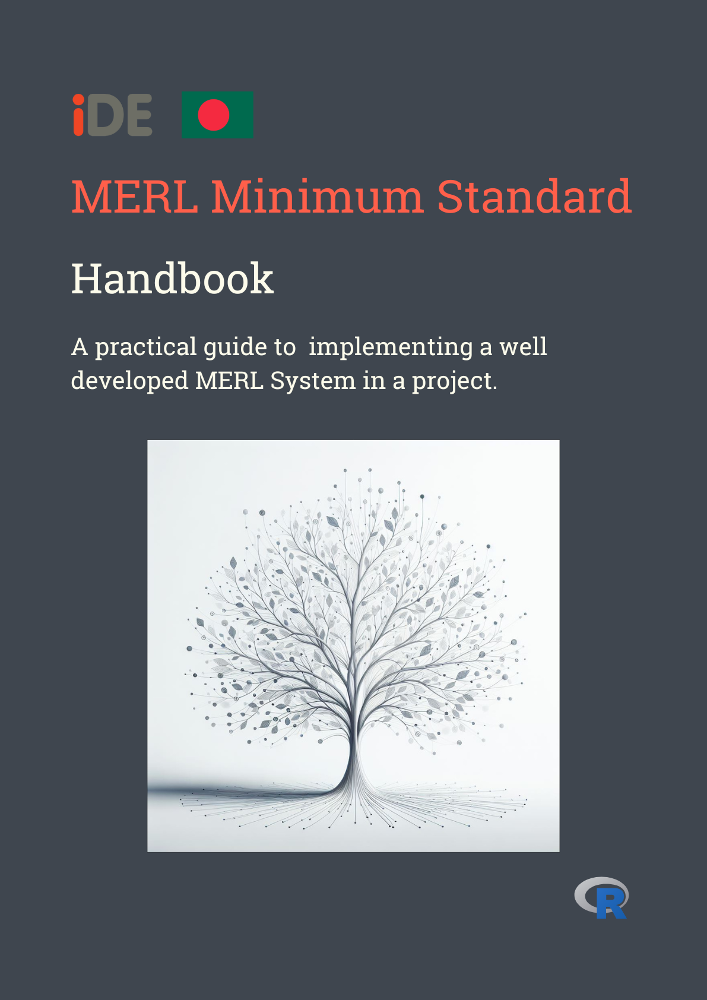

--- 
title: "iDE MERL Standard"
author: "Tasbiul Islam Nibir"
date: "`r Sys.Date()`"
site: bookdown::bookdown_site
documentclass: book
bibliography: [book.bib, packages.bib]
# url: your book url like https://bookdown.org/yihui/bookdown
cover-image: 'images/cover.png'
description: |
  This is an r bookdown developed handbook describing the minimum MERL standard of the projects 
  implemented by iDE Bangladesh. The handbook is a continously updated by the help and coordination of MERL and
  project team for maintaining the minimum MERL standards in the different project
link-citations: yes
github-repo: rstudio/bookdown-demo
---
```{r setup, include=FALSE}
knitr::opts_chunk$set(echo = TRUE)
```
# Preface {-}
<div style="float:right; margin-left: 20px;">
  
</div>
This is a handbook intended to work as a guideline for all the stakeholders of the respective projects to understand the different MERL activities and the MERL systems implemented in the different project.
In the book, Each **chapter** in the book is specific to that *chapter name*. A chapter name is self-explanatory to the `chapter contents`. The reader can read this guidebook to get an idea of how the project MERL standard should be maintained.
## Usage {-}
Each **chapter** in the book is specific to that *chapter name*. A chapter name is self-explanatory to the `chapter contents`. The reader can read this guidebook to get an idea on how the project MERL standard should be maintained.
This handbook is only relevant to the iDE staffs and stakeholders who are related to the iDE implemented projects.
```{r, eval=FALSE, echo=FALSE}
bookdown::render_book()
```
## Introduction {-}
This handbook has been divided into several chapters to easily navigate to the specific sections that the readers are interested in. The specific sections are as follows:
```{r eval=FALSE, echo=FALSE}
bookdown::serve_book()
```
1. About
    1. About iDE
    2. About iDE Projects
    3. About iDE MERL System
2. General MERL  Standard
3. Minimum MERL Standard for Oporajita
4. Minimum MERL Standard for BNA
5. Minimum MERL Standard for CCSU
6. Minimum MERL Standard for B4CA
7. Minimum MERL Standard for CSISA-MEA
8. Minimum MERL Standard for Uddokta
9. Minimum MERL Standard for Nobopollob
10. Minimum MERL Standard for SanMarks
11. Minimum MERL Standard for PSM-||
```{r include=FALSE}
# automatically create a bib database for R packages
knitr::write_bib(c(
  .packages(), 'bookdown', 'knitr', 'rmarkdown'
), 'packages.bib')
```
